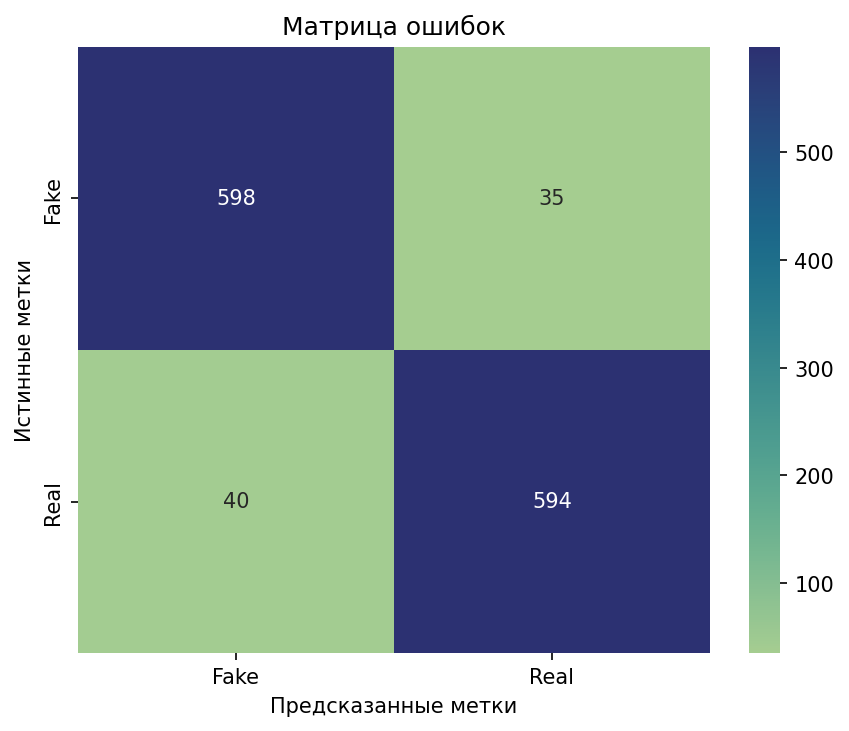
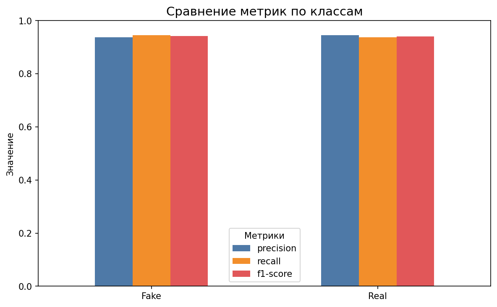
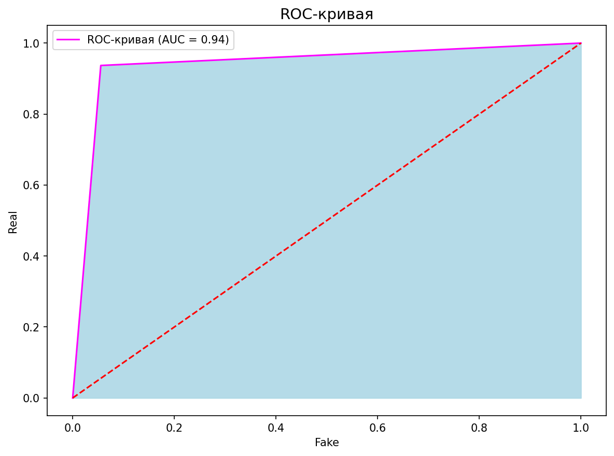

# 🔍 Fake News Detector — Классификатор фейковых новостей

Модель машинного обучения для автоматического определения **реальных (REAL)** и **фейковых (FAKE)** новостей с точностью **>90%**.  
Проект демонстрирует полный ML-пайплайн: от анализа данных до CLI-инструмента и веб-демо.
Датасет: https://storage.yandexcloud.net/academy.ai/practica/fake_news.csv

---

## 🎯 Цель
Борьба с дезинформацией с помощью классических методов NLP:  
- **TfidfVectorizer** для извлечения признаков  
- **PassiveAggressiveClassifier** для обучения  
- Точность на тестовой выборке: **>90%**

---

## 🛠️ Технологии
- **Управление зависимостями**: [Poetry](https://python-poetry.org/)
- **ML**: `scikit-learn`, `pandas`
- **Визуализация**: `matplotlib`, `seaborn`
- **Интерфейсы**:  
  - CLI: `fake-news-predict`  
- **Исследование**: Jupyter Notebook

---

## 📊 Результаты
- **Точность**: 94.2%
- **Матрица ошибок**:



- **Сравнение метрик по классам**:



- **ROC-кривая**:



---

## 🚀 Как запустить

### 1. Клонировать и перейти в проект
```bash
git clone https://github.com/Mojusei/fake-news-detector.git
cd fake-news-detector
```

### 2. Установить зависимости через Poetry
```bash
# Убедитесь, что Poetry установлен
poetry install
```

### 3. Обучение модели (если необходимо)
```bash
poetry run python -m src.train
```

### 4. Использование консоли для предсказания
```bash
poetry run fake-news-predict "Scientists have discovered a cure for old age!"
# Вывод: 🔍 Результат: FAKE
```

### 5. Анализ
```bash
poetry run jupyter notebook notebooks/fake_news_exploration.ipynb
```
